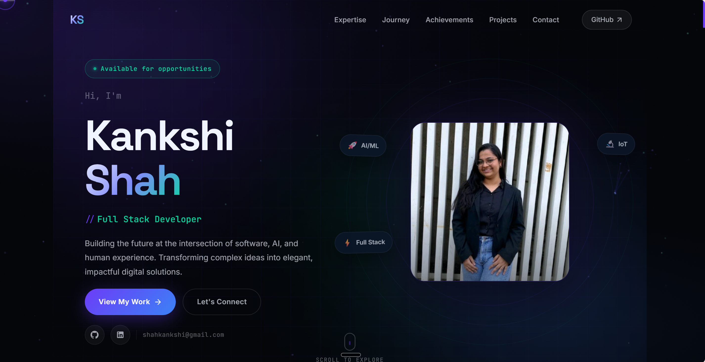

# My Portfolio 🚀

      

## 📋 About

Welcome to my professional portfolio! This is a modern, fully-featured portfolio website built with cutting-edge web technologies. It showcases my professional journey, technical expertise, past projects, and accomplishments in a clean, interactive, and engaging way.

**[View the Live Demo](https://kankshi19.github.io/my-portfolio/)**

---

## 📸 Preview



---

## ✨ Key Features

- ✅ **Open Source** — Free to use, no attribution required
- ✅ **Fully Responsive** — Looks great on desktop, tablet, and mobile devices
- ✅ **Dark & Light Modes** — Beautiful theme support for user preference
- ✅ **Highly Customizable** — Multi-component modular architecture for easy personalization
- ✅ **Modern Tech Stack** — Built with React, TypeScript, and SCSS
- ✅ **Smooth Animations** — Elegant fade-in effects and smooth scrolling
- ✅ **Custom Cursor** — Unique interactive cursor experience
- ✅ **Performance Optimized** — Fast load times and smooth interactions
- ✅ **SEO Friendly** — Properly structured for search engines

---

## 🛠️ Tech Stack

- **Frontend Framework:** React with TypeScript
- **Styling:** SCSS (Sass) for advanced styling
- **Tooling:** npm, Node.js
- **Markup:** HTML5
- **Scripting:** JavaScript ES6+
- **Build:** React Build Tools

---

## 📁 Project Structure

```
src/
├── components/              # Reusable React components
│   ├── Achievements.tsx     # Achievements section
│   ├── Contact.tsx          # Contact form section
│   ├── CustomCursor.tsx     # Custom cursor component
│   ├── Expertise.tsx        # Skills & expertise section
│   ├── Footer.tsx           # Footer component
│   ├── Loader.tsx           # Loading animation
│   ├── Main.tsx             # Hero/main section
│   ├── Navigation.tsx       # Navigation bar
│   ├── Project.tsx          # Projects showcase
│   └── Timeline.tsx         # Career timeline
├── assets/
│   ├── images/              # Image assets & screenshots
│   └── styles/              # Global and component styles
├── utils/
│   └── reveal.ts            # Scroll reveal utility
├── App.tsx                  # Main app component
└── index.tsx                # Entry point
```

---

## 🚀 Getting Started

### Prerequisites

- Node.js (v14 or higher)
- npm or yarn package manager

### Installation

1. **Clone the repository:**
   ```bash
   git clone https://github.com/kankshi19/my-portfolio.git
   cd my-portfolio
   ```

2. **Install dependencies:**
   ```bash
   npm install
   ```

3. **Start the development server:**
   ```bash
   npm start
   ```

4. **Open your browser:**
   - Navigate to `http://localhost:3000`
   - The app will automatically reload as you make changes

---

## 🔧 Customization Guide

This portfolio is built to be easily customizable. Here's how to personalize it:

### Update Content
- **Navigation:** Edit `src/components/Navigation.tsx`
- **Hero Section:** Modify `src/components/Main.tsx`
- **About/Skills:** Update `src/components/Expertise.tsx`
- **Projects:** Customize `src/components/Project.tsx`
- **Timeline:** Edit `src/components/Timeline.tsx`
- **Contact:** Update `src/components/Contact.tsx`

### Styling
- Global styles: `src/assets/styles/theme.scss`
- Component-specific styles: Individual `.scss` files in `src/assets/styles/`

### Images
- Replace or add images in: `src/assets/images/`

---

## 📦 Build & Deployment

### Build for Production

```bash
npm run build
```

This creates an optimized production build in the `build/` directory.

### Deploy to GitHub Pages

The portfolio is configured to deploy to GitHub Pages. Simply push to the `master` branch, and the CI/CD pipeline will handle deployment.

---

## 🎨 Features in Detail

### Dark & Light Mode
- Automatic theme detection based on system preferences
- Manual theme toggle available
- Smooth transitions between themes

### Responsive Design
- Mobile-first approach
- Optimized layouts for all screen sizes
- Touch-friendly interactions

### Smooth Animations
- Fade-in effects on scroll
- Smooth page transitions
- Custom cursor animations

### Interactive Elements
- Hover effects
- Click interactions
- Scroll-triggered reveals

---

## 👤 About Me

I'm a passionate web developer dedicated to building beautiful, functional web experiences. This portfolio represents my journey and expertise in modern web development.

**Connect with me:**
- 🌐 [Portfolio](https://kankshi19.github.io/my-portfolio/)
- 💼 [GitHub](https://github.com/kankshi19)

---

**Last updated:** 2026-06-18  
